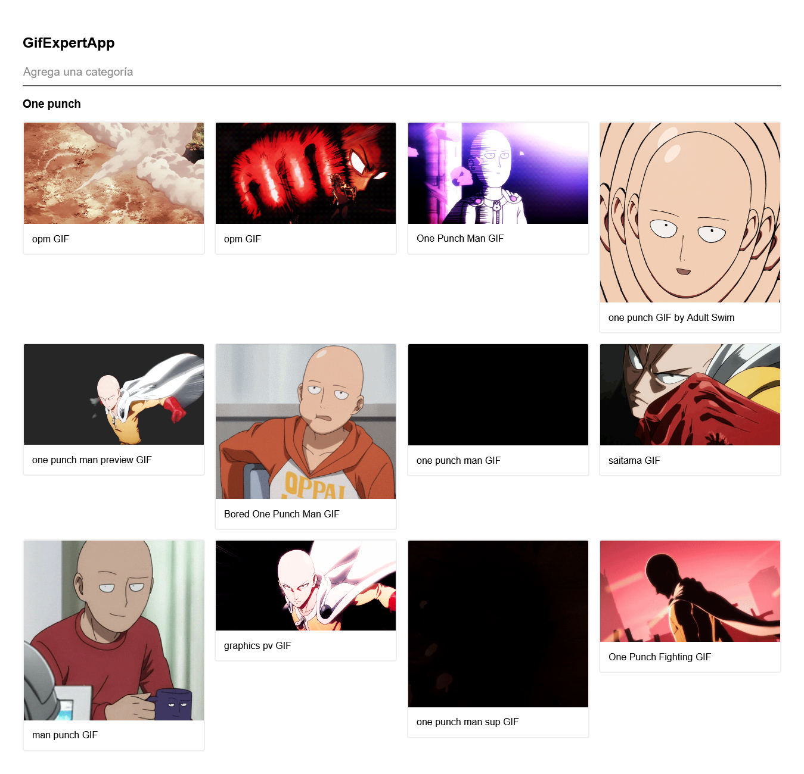

# React GifExpertApp

## Description

Getting gifs from Giphy API

**This is an React app from Udemy course [React: de cero a experto (Hooks y MERN)](https://www.udemy.com/course/react-cero-experto)**

## Screenshot 📸

## Built with 🔧

- create-react-app
- CSS grid for the grid component
- Hooks (_useState and useEffect_)
- Custom hook (_useFetchGifs_).
- Animate.css library.

## Live demo 🔗

👉 [Link](https://gif-expert-app-iota.vercel.app/)

## Author 🧔

[Marcos Pennachini](https://linkedin.com/in/marcos-pennachini)
